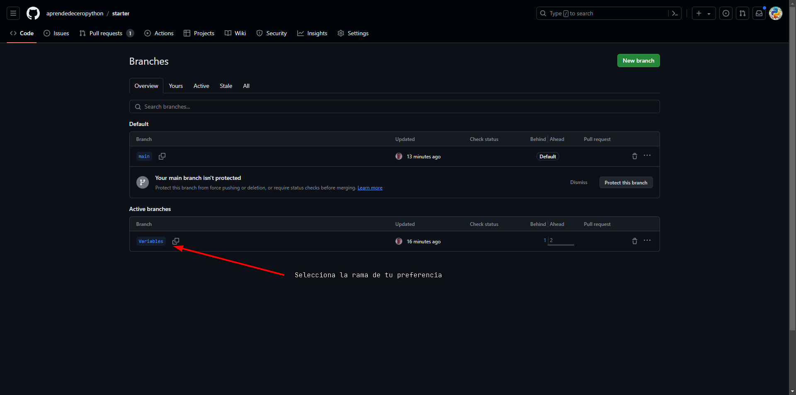

# Curso de Python desde cero

Este curso está diseñado para aquellos que no tienen conocimientos de programación.  

## Cómo participar

- Haz un `fork` del proyecto [starter](https://github.com/aprendedeceropython/starter) a tu repositorio personal:  

- Cambia a la rama o `branch` de tu elección:  

- Añade el código Python solicitado en la práctica.  
- Solicita un `pull request` de tu código al proyecto principal.  

### Aceptación del código
- Una vez efectuada la PR(1), el código será revisado por compañeros más expertos de la comunidad.  
- Este puede ser aceptado, modificado o rechazado.  

### Cómo seleccionar cada práctica

- Solo debes cambiarte al `branch` o rama de cada práctica y seguir las instrucciones.

## Consejos iniciales
- Debes tener Python instalado en tu PC (es recomendable que marques la opción de añadir Python al PATH).
- Puedes comprobar que Python está instalado si abres una ventana de terminal y escribes `python --version`. Según tu sistema operativo y la versión del programa, Python puede tener otro nombre: `py`, `python3`.
- Si no dispones de un editor para programar (IDE), puedes escribir el código con un bloc de notas; o simplemente escribe `python` en tu consola. Aparecerá esto al inicio de la línea `>>>` y podrás escribir tus líneas de código. Escribe `exit()` para salir del modo interactivo.
- Para poder ejecutar tu aplicación, escribe en una consola de tu sistema operativo `python nombre_de_tu_aplicacion.py`.

> 💡 **Terminales**  
> - Un emulador de terminal o de consola te permite comunicarte con tu equipo mediante sentencias y órdenes.  
> - En Windows, puedes usar una ventana de PowerShell o de Símbolo del sistema (CMD). En MacOs, abre Terminal. En Linux dependerá de la distribución.  
> - Los editores (IDE) como Visual Studio Code integran estos programas para que puedas ejecutar tu código sin necesidad de salir de ellos.